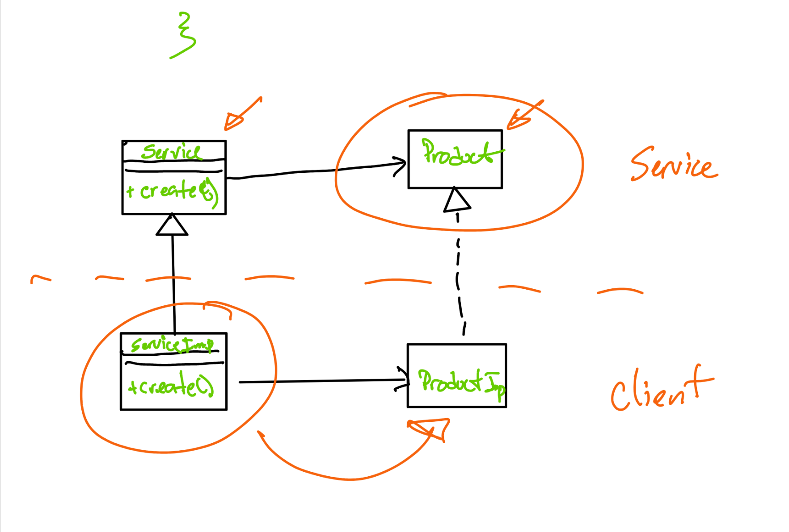
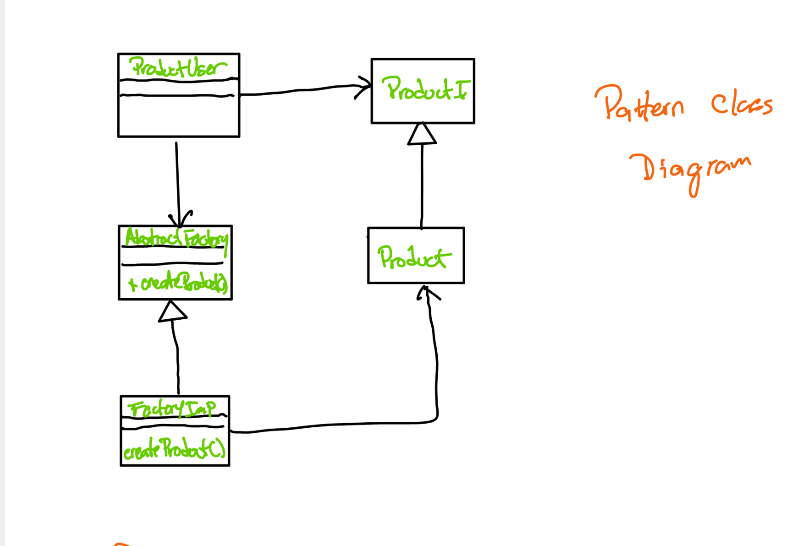
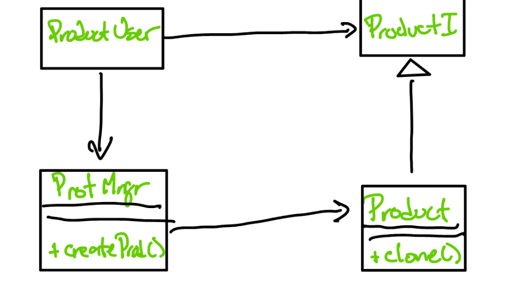
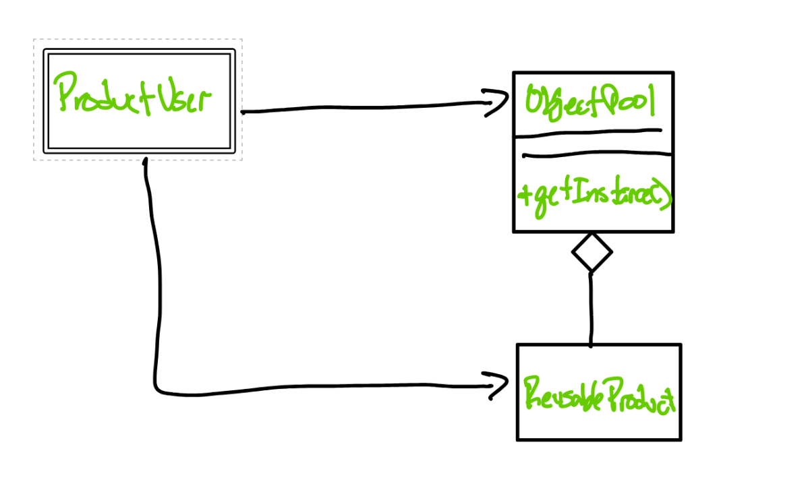
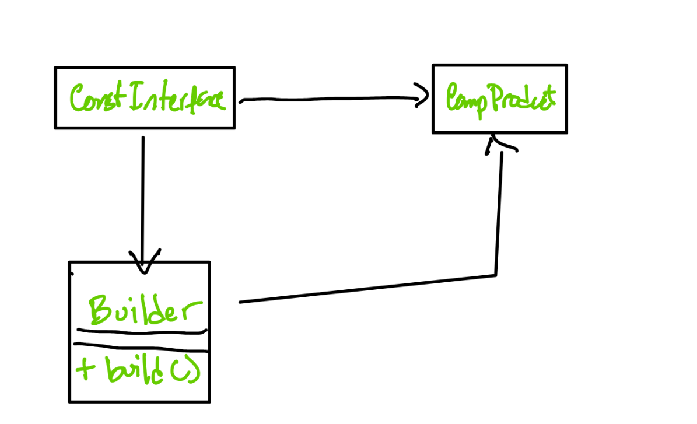
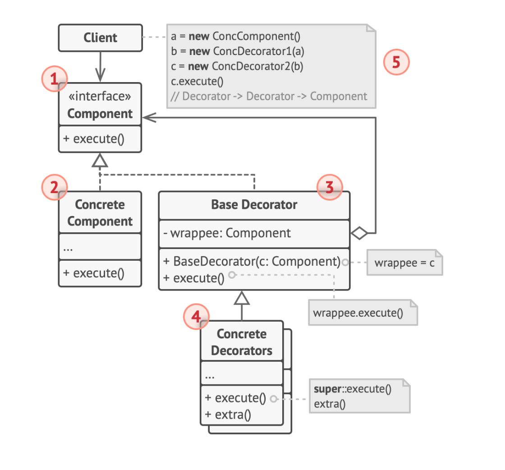
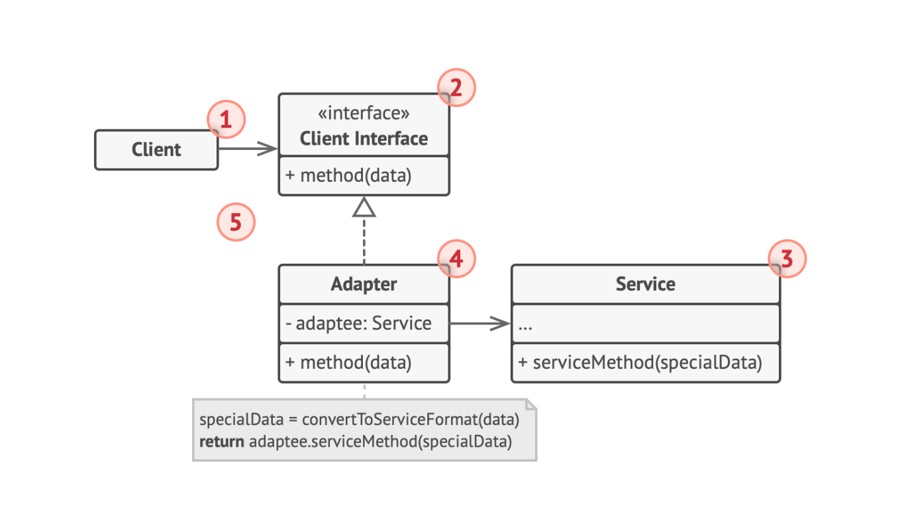
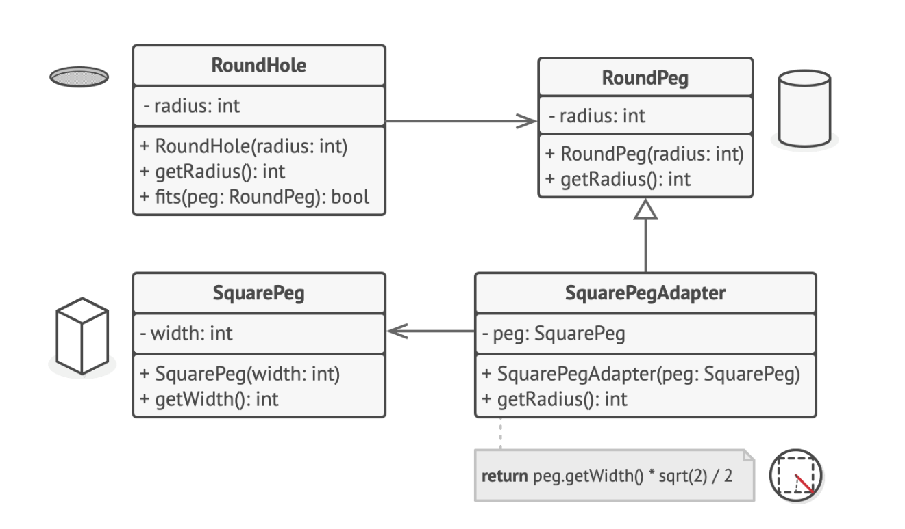
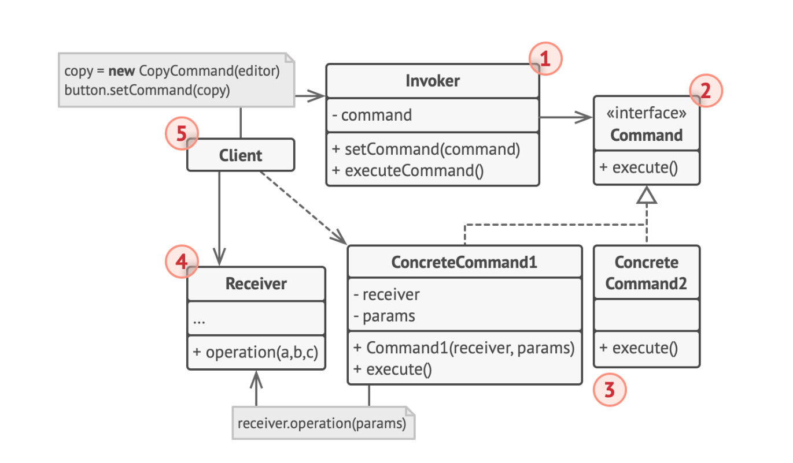
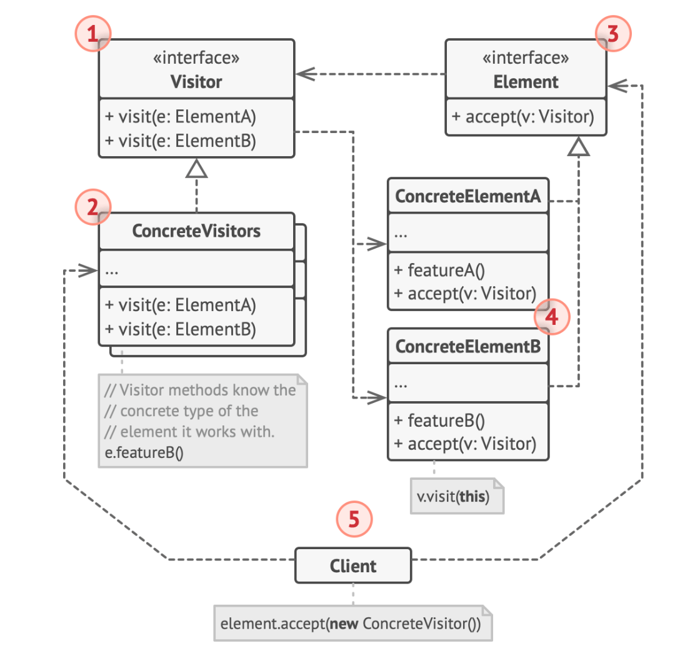

# Software Engineering

* Making Software
* Maintaining Software

The application of a systematic, quantifable, disciplined, approach to the development operation and maintenance of software. In others, the application of engineering to software tasks.

## Stages of Software Engineering
### SDLC

* Requirements Engineering
* Design
* Implementation
* Verification (Testing)
* Maintainence


### Models

#### Waterfall
Requirements -> Design -> Implementation -> Verification -> Maintainence

One after the other

* Strict, not-flexible approach
* Too rigid - products need to refine aspects of products
* Still used in areas that call for rigid process, such as safety critical applications.

#### Incremental

Prototype <-> Refinement -> Product

```
Requirements <-> Design -> Implementation -> Verification -> Operational/Maintenance
```

#### Evolutionary

Spiral Modal
Design -> Implemtation -> Verification -> Maintaintence ->

#### Formal Methods

* Using mathematical models to derive mathematical guarantees of correctness and assurance with automated tools

### Agile Way

* Evolutionary Process
* Importance between cross-collaboration (different teams) extremely important
* Self-organizing cross-functional teams
* Adaptability and Flexibility
* Early and continuous delivery
* Regular evaluation and tuning of process
* Simplicity: maximize amount of work not done


#### Optimal conditions for the application of Agile:
* Criticality is low-to-medium
* Team of experienced independent individuals
* Requirements change often
* Small number of developers

#### Extreme Programming (XP)
* Frequent delivery in short-cycles.
* Checkpoints at which requirements are evaluated
* Pair-programming
    * One driver (programmer) one observer and they work on one feature at a time
* Code reviews
* Unit Testing

#### SCRUM
* Co-location
    * Everyone should work at the same location
* Face-to-face interactions
* High adaptability
* Three pillars:
* Roles:
  * Product owner
  * SCRUM Master
  * Development Team
* Frequent Reviews
* Planning
  * Timeboxed development: development is done in "sprints". which last between 1week-1month.
  * Spring planning meeting at the beginning.
  * Daily SCRUM meetings

### Requirements Engineering

The part of the process that are specificed, defined and maintained

#### Stages
* Requirements Elicitation
* Requirements Analysis (Negotation)
  * Use-case scenarios
  * Interaction, sequence diagrams
  
##### Software Requirements Specification
Broke into **functional** and ***non-functional**

* Functional - step by step responses 
* Non-functional - qualities of the system

 Requirements validation -> approved by stakeholders

 Requirements maintainence -> return to requirements and reconsideration


 ##### Data Modeling

 Entity relationship diagram


 # System Design

 ## Structional Partitioning
 Design is partitioned along data and functional boundaries

 Break relationships into different modules.

 ## Modularity
 System is designed into separate components that have well defined boundaries and interfaces

 ## Low Coupling:

 Modules are highly independant with a minimum amount of dependencies

 ## High Cohesion:

Elements insde of a module have a high degree of interaction

# Solid Principles

A set of software design/implemntation principles to create easily scalable and maintainable code

## **S**ingle-Responsibility Principle
Every element in a program/system should have only one responsibility

## **O**pen for Extension, Closed for Modification Principle
Extensions can be done by creating new code modules, not by modifying the existing coe base.

## **L**iskov's Substitution Principle
If you have a type A and a type B, which is a subtype of A, then you can subtitute instances of type A with type B without changing the functionality of the program.

## **I**nterface segregation principle
Implementors of interfaces should not be forced upon functions that they do not use.

Favor specific interfaces over general ones.

Create smaller interfaces

## **D**ependency Inversion

Depend upon abstractions, not concretions.

# Design Patterns


## Factory Method


```
abstract class C {
  private List l;

  C() {
    l = makeList();
  }

  abstract public List makeList();
}

public class D extends C {
  public List MakeList() {
    return new ArrayList();
  }
}
```



## Abstract Factory

Delegate object creation completely into another class 

```

public interface ListMaker {
  public List createList();
}

public ArrayListCreator implements ListCreator {
  public List createList() {
    return new ArrayList();
  }
}

public class C {
  ListMaker lm;
  public C(ListMaker &m) {
    this.lm = lm;
  }

  ...somewhere in another function ...

  List l = lm.createList();
}
```


## Dependency Injection

Decouple layers by inverting dependencies through function argument injection: concrete types are specified at object construction:

```
public class C {
  private List l;
  public C(List l) {
    this.l = l;
  }
}

public class CUser {
  ...
  C co = new C(new ArrayList())
  ...

}
```


## Prototype:

Create an object that represents a prototype for new kinds of that object. Every time a new kind of widget is needed, create a new prototype and clone it for new instances of that widget.

Used a lot in UI frameworks.



## Object Pool:

Reduce memory footprint incurred from object allocation by pooling objects. Instead of allocating an object when an instance is needed, we simply get a feww object from the pool, and release back into the pool when we're done with it. This reduces the runtime penalty of memory allocation.



## Builder:

Abstracts constructions of complex objects



# Structural Patterns

## Decorator

Dynamically add features/functionality to a component by wrapping the core component with another component that adds the functionality



```
/ The component interface defines operations that can be
// altered by decorators.
interface DataSource is
    method writeData(data)
    method readData():data

// Concrete components provide default implementations for the
// operations. There might be several variations of these
// classes in a program.
class FileDataSource implements DataSource is
    constructor FileDataSource(filename) { ... }

    method writeData(data) is
        // Write data to file.

    method readData():data is
        // Read data from file.

// The base decorator class follows the same interface as the
// other components. The primary purpose of this class is to
// define the wrapping interface for all concrete decorators.
// The default implementation of the wrapping code might include
// a field for storing a wrapped component and the means to
// initialize it.
class DataSourceDecorator implements DataSource is
    protected field wrappee: DataSource

    constructor DataSourceDecorator(source: DataSource) is
        wrappee = source

    // The base decorator simply delegates all work to the
    // wrapped component. Extra behaviors can be added in
    // concrete decorators.
    method writeData(data) is
        wrappee.writeData(data)

    // Concrete decorators may call the parent implementation of
    // the operation instead of calling the wrapped object
    // directly. This approach simplifies extension of decorator
    // classes.
    method readData():data is
        return wrappee.readData()

// Concrete decorators must call methods on the wrapped object,
// but may add something of their own to the result. Decorators
// can execute the added behavior either before or after the
// call to a wrapped object.
class EncryptionDecorator extends DataSourceDecorator is
    method writeData(data) is
        // 1. Encrypt passed data.
        // 2. Pass encrypted data to the wrappee's writeData
        // method.

    method readData():data is
        // 1. Get data from the wrappee's readData method.
        // 2. Try to decrypt it if it's encrypted.
        // 3. Return the result.
```
## Adapter Pattern
A pattern that allows change one interface into another, by wrapping the adapter with an adapter object.



# Behavior Patterns

## Command

Decouple data from behavior by abstracting actions into a command interface.

A separate class encapsulate function calls and the execution of these actions is delegated to a separate class.



## Iterator Pattern

## Visitor Pattern
Pattern used to implement the function applied to every element of a particular structure as it is traversed

```
class Visitor {
  func visitA(A: a);
}

class A {
  func accept(Visitor: v) {
    v.visitA(this);
  }
}
```

